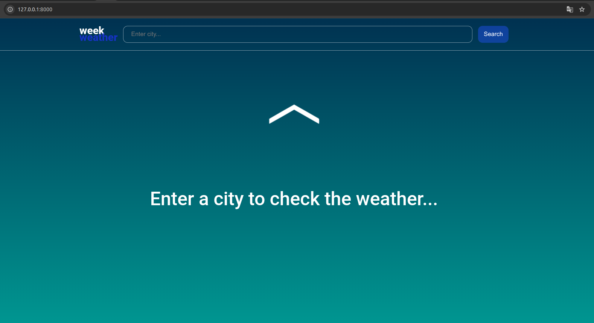
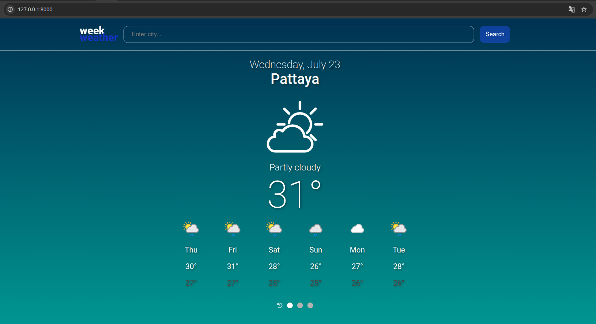
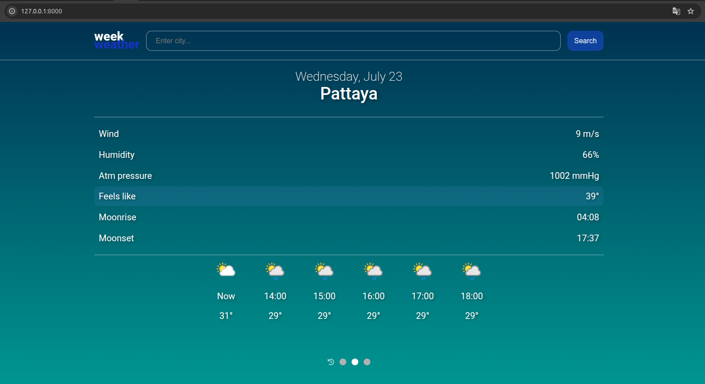
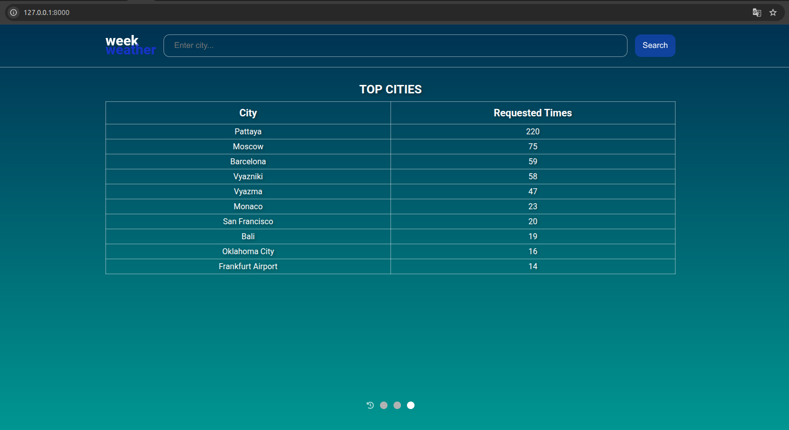
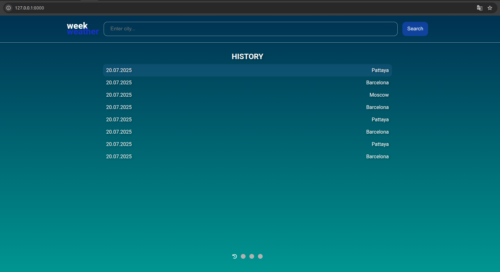
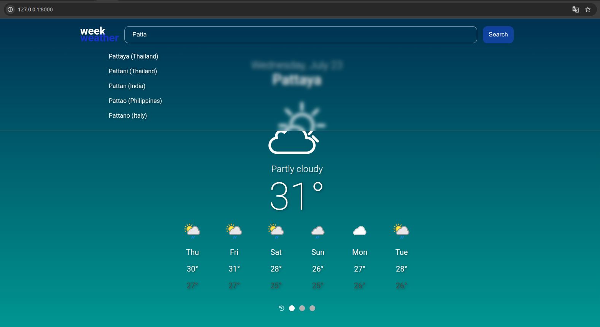

# 🌤 Python Developer Test Task — Week Weather

## Launch Instructions

You need to create a .env file in the app/ directory and add the environment variable
WEATHER_API_KEY.
You can obtain the API key by registering at
https://www.weatherapi.com/login.aspx and accessing your account,
or by contacting me on Telegram @sp28337.

- make image (build the Docker image)
- make docker (run the container)

---
## Tests

enter ". pytest" in terminal 

---

This solution follows industry best practices.
**Technologies used:**  
- [FastAPI](https://fastapi.tiangolo.com/) — modern asynchronous Python web framework  
- [SQLite (SQLAlchemy)](https://www.sqlalchemy.org/) — request history tracking  
- [Jinja2](https://jinja.palletsprojects.com/) — templating  
- [Docker](https://www.docker.com/) - isolation
- [pytest](https://docs.pytest.org/) — testing  

---

## Released
- [X] User-friendly and readable forecast format
- [X] Search history for each user (tracked via cookie)
- [X] On repeat visits — displays the forecast for the previously searched city
- [X] API for city input statistics
- [X] Autocomplete for city input
- [X] Docker container support
- [X] Tests

## Screenshots

